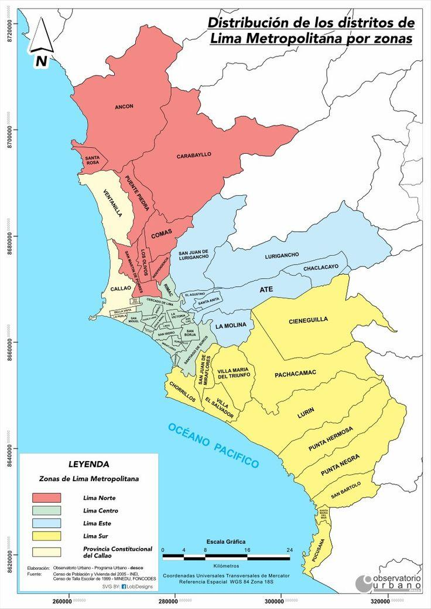

# Aplicación del Modelo de Fay-Herriot para la Estimación de Ingresos Reales Distritales

## Descripción

Proyecto desarrollado para la asignatura **Técnicas de Muestreo** de la **Universidad Nacional de Ingeniería (UNI)**, cuyo objetivo es estimar y analizar la evolución de los ingresos reales de los distritos de Lima Metropolitana durante el periodo **2019–2024**.

Debido a los reducidos tamaños muestrales en algunos distritos, las estimaciones directas presentan una elevada variabilidad o no pueden ser calculadas. Para solucionar este problema se aplica el **modelo de Fay-Herriot**, una metodología de estimación en áreas pequeñas que combina las estimaciones directas de la **ENAHO** con información auxiliar proveniente del **Censo Nacional 2017**.

## Metodología

### 1. Procesamiento de la ENAHO

El notebook `ENAHO2024.ipynb` contiene el procesamiento de la información de la **ENAHO** utilizada para el análisis de los ingresos distritales de Lima Metropolitana.

En esta etapa se realiza:

- Limpieza y preparación de la información de la ENAHO.
- Selección de los distritos de Lima Metropolitana mediante el código **UBIGEO**.
- Identificación del tamaño muestral por distrito.
- Cálculo de las **estimaciones directas del ingreso** utilizando los factores de expansión.
- Cálculo del error estándar y coeficiente de variación de las estimaciones.
- Identificación de distritos con tamaños muestrales reducidos.
- Integración de la información con las variables auxiliares provenientes del Censo.
- Preparación de los datos necesarios para la aplicación del **modelo Fay-Herriot**.

Los resultados obtenidos en esta etapa constituyen la información de entrada para la estimación EBLUP a nivel distrital.

### 2. Variables auxiliares

Se incorporaron variables provenientes del Censo, considerando:

- Semana de trabajo
- Conexión a internet

### 3. Modelo Fay-Herriot

Se estimaron los coeficientes mediante mínimos cuadrados ponderados
y la varianza del efecto aleatorio mediante REML.

**Resultado:**
Varianza del efecto aleatorio (σ²_u) estimada por REML: 1100350.201682

### 4. Estimación EBLUP

Se combinaron las estimaciones directas con las predicciones del modelo
mediante el factor de shrinkage (γ).

**Comparacion vs Estimacion Directa**

### 5. Ajuste por inflación

Las estimaciones fueron deflactadas para obtener ingresos reales
comparables durante el periodo 2019–2024.

**Tasa de Inflacion:**
Tasa de inflación aplicada: 1.97%

### 6. Clasificación socioeconómica

Los distritos fueron clasificados según los rangos de ingreso utilizados
en el estudio.

## Resultados

### Clasificación socioeconómica
**Todos los Distritos según EBLUP (Clasificación por Nivel de Ingreso)**

**Top 20 Distritos según EBLUP (Clasificación por Nivel de Ingreso)**

### Distritos con mayor crecimiento

### Distritos con mayor decrecimiento

## Principales resultados

El modelo Fay-Herriot permitió obtener estimaciones para distritos con poca información muestral y reducir la variabilidad de las estimaciones directas.

El análisis del factor de shrinkage mostró el grado en que cada distrito depende de la información directa de la encuesta o de la predicción proporcionada por el modelo.

Asimismo, se identificaron diferencias importantes en la evolución de los ingresos reales entre los distritos de Lima Metropolitana. Entre los distritos con mayor crecimiento durante el periodo analizado se encontraron **Chaclacayo, San Bartolo, Carabayllo, Punta Negra e Independencia**. Por otro lado, **Punta Hermosa, San Isidro, San Borja, Miraflores y Surquillo** presentaron los mayores decrecimientos.

## Herramientas y técnicas

* **Python**
* Pandas / NumPy
* Análisis estadístico
* Estimación en áreas pequeñas (SAE)
* Modelo de Fay-Herriot
* EBLUP
* REML
* Weighted Least Squares (WLS)
* Análisis de correlación
* Visualización de datos

## Autores

**Rosa Davila Ponce**

**Angelo De la Cruz Paucar**

**Mauricio Rico Peña**
